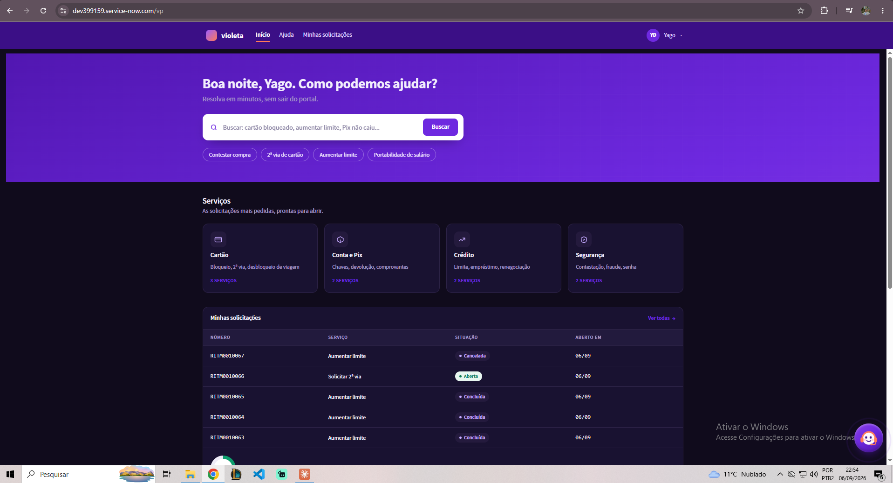
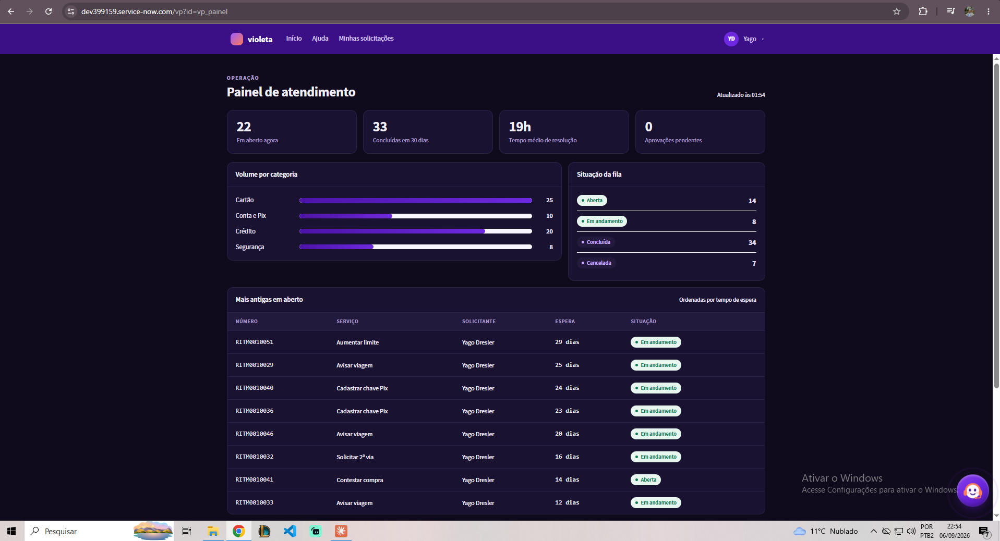
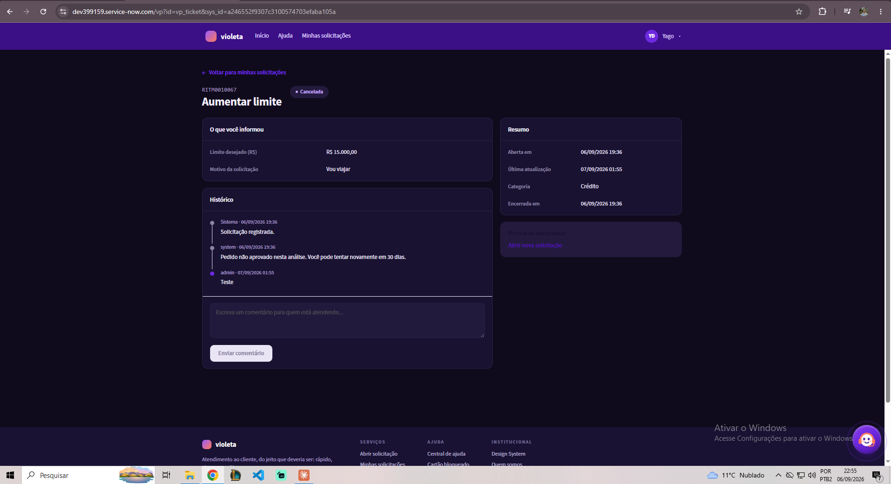
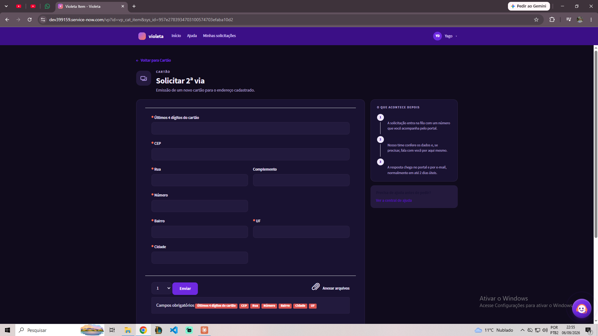

# Portal Violeta — Service Portal customizado no ServiceNow

Portal de autoatendimento de um banco digital fictício, construído do zero sobre o
Service Portal do ServiceNow. A regra imposta ao projeto foi simples: **nenhuma tela de
fábrica**. Home, catálogo, confirmação, base de conhecimento, aprovações, painel do
atendente e até a página 404 foram construídos em widgets próprios.

> **Violeta é uma marca fictícia**, criada exclusivamente para este projeto de portfólio.
> Nenhuma instituição financeira real está representada aqui.

---

## Stack

| Camada | Tecnologia |
|---|---|
| Plataforma | ServiceNow (PDI) |
| Módulo | Service Portal — `/vp` |
| Frontend | AngularJS, HTML, SCSS |
| Backend | GlideRecord, GlideAggregate, Script Include, Business Rule |
| Automação | Flow Designer, Notification |
| Integração | ViaCEP via `sn_ws.RESTMessageV2` |

---

## O que o portal faz

**Jornada do cliente** — home com busca e categorias, lista de itens, formulário de
catálogo, confirmação, "minhas solicitações" e detalhe com histórico e comentários.

**Integração com CEP** — o Script Include `VioletaCEP` consome a API pública ViaCEP e o
Catalog Client Script preenche rua, bairro, cidade e UF enquanto o cliente digita.

**Aprovação automática** — pedidos de aumento de limite acima de R$ 10.000 entram em
análise manual, via Business Rule + Flow Designer.

**Painel do atendente** — indicadores agregados com `GlideAggregate`: fila por situação,
volume por categoria, tempo médio de resolução e as solicitações mais antigas em aberto.

**Base de conhecimento** — FAQ na home e leitor de artigo próprio.

**Modo escuro** — alternância no cabeçalho, com a preferência salva em `localStorage`.

---

## Como restaurar em outra instância

### 1. Importe as Update Sets, nesta ordem

Em **Retrieved Update Sets → Import Update Set from XML**, carregue, dê *Preview* e
*Commit* em cada uma, uma de cada vez:

| Ordem | Arquivo | Conteúdo |
|---|---|---|
| 1º | `update-sets/01-portal-violeta-base.xml` | Portal, tema, cabeçalho, rodapé, páginas, widgets, catálogo, categorias e variáveis |
| 2º | `update-sets/02-portal-violeta-v4-estrutura.xml` | Containers e colunas das páginas, traduções, Flow, Catalog Client Script e permissões de KB |
| 3º | `update-sets/03-portal-violeta-v3-visual.xml` | Widgets e ajustes visuais mais recentes (modo escuro, scroll reveal, micro-interações) |

A ordem importa: a v3 é a mais recente e precisa ser commitada por último para que suas
versões dos widgets fiquem por cima.

### 2. Rode os scripts

Em **System Definition → Scripts - Background**, escopo Global:

1. `scripts/01-complementos.js` — cria o campo `u_analise_manual`, o Script Include
   `VioletaCEP` e a Business Rule de análise manual
2. `scripts/02-carga-kb.js` — cria a base de conhecimento e os artigos

Ambos são idempotentes: rodar duas vezes não duplica nada.

### 3. Acesse `/vp`

Se o cabeçalho não aparecer, confira o campo **Header** do tema `Violeta Theme`. Ele só
lista registros da tabela `sp_header_footer` — um widget criado em `sp_widget` nunca
aparece ali.

---

## Decisão técnica que vale contar

A regra de aprovação começou lendo a variável do catálogo dentro do próprio Flow. **Não
funciona.** O gatilho *Service Catalog* dispara antes das variáveis serem gravadas, então
o Flow lia sempre o valor padrão. Um Timer de dez segundos mascarou o problema — funcionava
às vezes, e "às vezes" não é solução.

A saída foi mover a decisão para onde o dado já existe: uma Business Rule *before insert*
lê `current.variables.limite_desejado`, normaliza o texto (`"R$ 15.000,00"` → `15000`) e
grava um campo real. O Flow então faz um *Look Up Record* nesse campo e ramifica com
segurança.

Detalhe do Flow Designer que custou tempo: um `If` aninhado dentro do ramo "então" de
outro `If` nunca é avaliado quando o primeiro é falso. O ramo de rejeição precisa ser um
`Else` no mesmo nível de indentação.

---

## Limitações conhecidas

Documentadas de propósito.

- **E-mail não é entregue na PDI.** A notificação é gerada e fica em `send-ready` porque a
  instância não tem `sys_email_account` de saída provisionada. A lógica está correta e
  funciona em instância com e-mail habilitado.
- **ATF incompleto.** Os testes de Service Portal e o script de carrinho com `sn_sc.CartJS`
  ficaram pendentes.
- **Modo escuro por injeção de CSS.** O compilador SCSS do Service Portal não aplicou as
  regras de forma confiável, então o CSS do tema escuro é injetado em tempo de execução
  pelo controller do cabeçalho, com `!important`. Funciona de forma consistente, mas o
  caminho limpo seria variáveis CSS no tema. É dívida técnica assumida.
- **Dados de demonstração.** As solicitações que aparecem nos prints são de teste e não
  acompanham o repositório.

---

## Documentação completa

O arquivo `documentacao-portal-violeta.docx` traz a arquitetura detalhada, a lista de
páginas e widgets, o caderno de armadilhas encontradas durante a construção e o roteiro
de gravação do vídeo.

---

## Autor

**Yago Dresler** — ServiceNow Developer

- LinkedIn: https://www.linkedin.com/in/yagodresler
- Portfólio: https://developeryagodresler.netlify.app/
